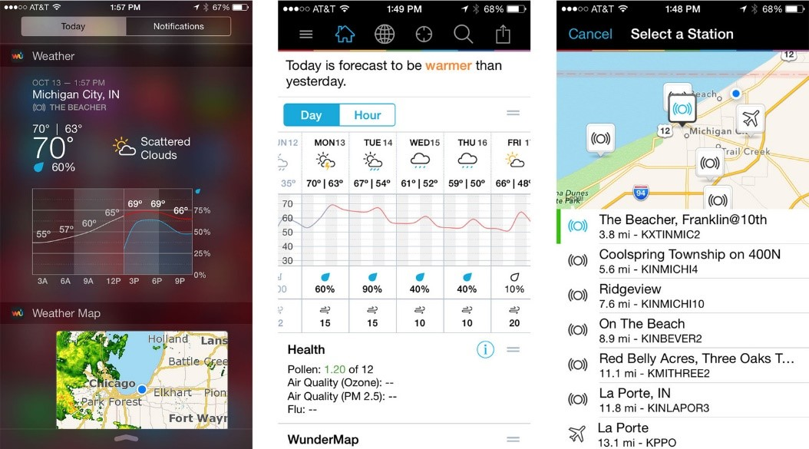
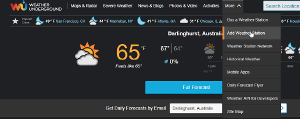
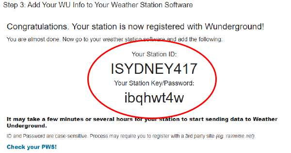
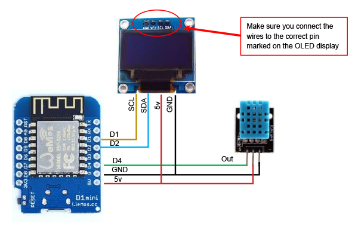
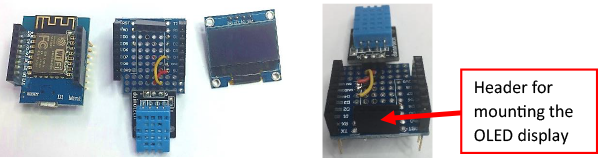
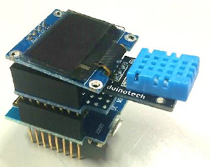
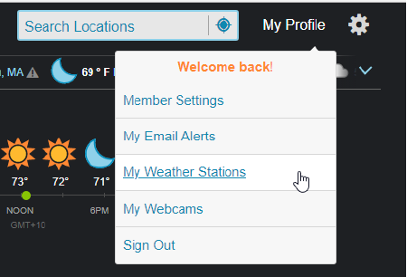
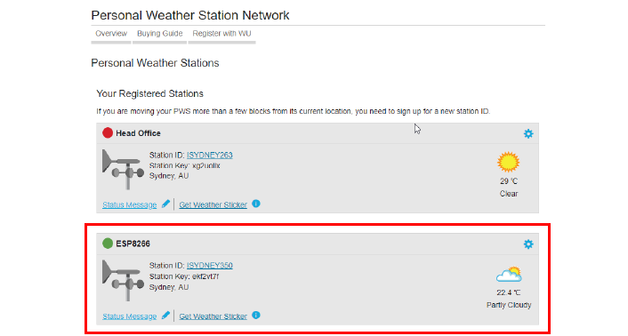
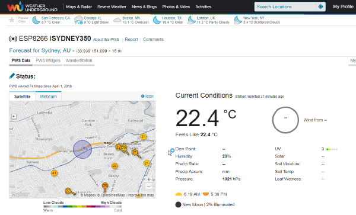

# Personal Weather Station

Build your very own weather station that not only displays the temperature and humidity but also reports the temperature and humidity readings to your Weather Underground account, where you can view the environmental readings from your weather station online, and even view historical logs of the environment temperature and humidity changes over time.



This project utilises the Temperature & Humidity sensor ( [XC4520](https://jaycar.com.au/p/XC4520)), together with the ESP8266, a OLED display is included in the project to make it more useful if you want to read the temperature and humidity locally. Otherwise the display may be omitted if you just want to take environmental readings via the Weather Underground website.

## Components

|Qty| Code | Description |
|---|---|---|
|1 | [XC3802](http://jaycar.com.au/p/XC3802) | ESP8266 Module
|1 | [XC3850](http://jaycar.com.au/p/XC3850) | Prototyping shield for ESP8266
|1 | [XC4384](http://jaycar.com.au/p/XC4384) | Monochrome OLED module
|1 | [XC4520](http://jaycar.com.au/p/XC4520) | Temperature Humidity sensor

## Before you start

It is assumed you already have installed the Arduino IDE ( [arduino.cc](https://www.arduino.cc/)), and you have also installed the hardware support for the ESP8266 ([github.com/esp8266/Arduino](https://github.com/esp8266/Arduino)).

You will need to have an account at [weatherunderground.com](https://www.wunderground.com/) , this is free and easy to set-up. Once you log into your account you will need to create your new weather station. From the top menu choose More and Add Weather Station, as shown below:



Follow the on-screen instructions, as the bear minimum you will need to enter a station description, such as "My Bedroom" (or anything else that best describes where you are monitoring the environment), and for device type just choose 'other'. At the end of this process you will be allocated a station ID and password, record this information because you will need it later on in the programming section.



Once you have this information, write it down and you're ready to start constructing and coding your project.

## Circuit & Assembly

This project is relatively easy to build, as per the wiring diagram below.



We used the Mini Prototyping Shield ( [XC3850](https://jaycar.com.au/p/XC3850)) to put all the components together. But feel free to construct your project according to your specific style, you could of course follow what we did below.





The final construction is neatly stackable boards, with the main ESP8266 main board at the bottom, followed by the D1 Mini Prototype Board (with all the wiring connections), and the OLED display mounted on top (using the additional headers that come with the D1 Mini Kit).

## Your WiFi Settings

Locate the WiFi SSID and password settings in the code, and change the values to match your WiFi network settings:

```c
cost char* ssid ="your WiFi SSID"
cost char* password ="your WiFi password"
```

###### Your Weather Underground Station Settings
Locate the ID and PASSWORD variables below, and change the value inside the quotation marks to your station ID and password settings, that you recorded when you created the station (see above):

```c
char ID [] = "your Weather Underground Station ID"
char PASSWORD [] = "your Weather Underground Station password"
```

That is all you need to do. Now simply download the code to your ESP8266 D1 Mainboard. You should see the display come on with the message "connecting to WiFi...", once the unit is connected to your WiFi network, there will be a short time when the unit synchronises to the network time. Then the display will show the date, time, temperature, and humidity readings. Note that when you first power on the unit the temperature and humidity readings will display '0' for about twenty seconds, until the sensor starts to record actual readings.

#### Using Weather Underground

You should have your personal weather station now running at the location where you wish to monitor the temperature and humidity. Next, log into your Weather Underground account, and navigate to MY Profile and My Weather Stations:



You will be presented with a screen that shows all the weather stations that you configured under your profile, which may look something like the below screen. Our Personal Weather Station appears under the name we gave it, "ESP8266", and the green dot besides it means that it is online and successfully reporting measurements to Weather Underground.



You can click on your weather station to view the detailed weather patterns and readings for your Personal Weather Station:



As you can see we are only reporting Temperature and Humidity. You can add more measurements like UV light readings, barometric pressure, etc. by simply connecting the respective sensor to your Personal Weather Station.
